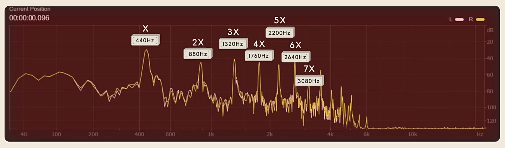

## 声学

- 声音：空气密度的纵波。
- 人能听到声音，是因为人耳能检测到空气密度的周期性变化。
- **理想弦模型 (弦鸣乐器)**：两端固定、均匀柔软的轻绳，振动时无摩擦且无阻尼。拨弦时，波碰到硬边界发生反射，干涉形成驻波，且边界处必为波节 (因为存在半波损)。此时设弦长 $L$，波长 $\lambda$，则驻波能够稳定存在的必要条件是
  $$L = n \cdot \frac{\lambda}{2} \quad (n=1,2,3,...)$$
  波速 $v = \sqrt{T / \mu} = \lambda f$ 恒定 (只与拉力和绳密度有关)，因此只存在以下频率
  $$f_n = n \cdot \frac{v}{2L} = nf_1 \quad (n=1,2,3,...)$$
  其中 $f_1$ 被称作**基本频率 (第一谐波，基频，音高)**，$f_2$ 被称作第一泛音 (第二谐波)，$f_3$ 被称作第二泛音 (第三谐波)，以此类推。可见只有整数倍谐波被保留了下来，称
  $$f_1, f_2, f_3, ... = f, 2f, 3f, ...$$
  为**谐波序列 (Harmonic Series，泛音列)**。

  

  > 你可以在 [到底什麼是「泛音列」？](https://nicechord.com/post/harmonic-series-once-and-for-all/) 这篇文章里聆听泛音列。
  
  拨弦给予的初始形状不是完美的正弦波，因此可以同时存在多种频率的谐波。**拨弦的位置决定各级谐音的强弱分布**：在弦中央拨弦，会抑制偶数阶谐波，声音更显柔和空洞；在靠近琴码 (端点) 处拨弦，会激发更多的高阶谐波，声音更显明亮尖锐。
  
  根据波激发方式的不同，弦鸣乐器可分为三类：
  - 拨弦类：用手指或拨片赋予初始位移。吉他、古筝、竖琴。
  - 击弦类：用琴槌敲击赋予瞬间冲击力。钢琴、扬琴。
  - 擦弦类：用弓毛摩擦弦。小提琴、大提琴、二胡、马头琴。
- **理想管模型 (气鸣乐器)**：相比理想弦模型，理想管的边界取决于管端的开口与封闭。
  
  对于**开管模型**，两端均为波腹，所有谐波齐全。
  - 长笛、双簧管、萨克斯、所有铜管、巴松管。
  
  对于**闭管模型**，两端一开一闭，驻波稳定存在的必要条件变为
  $$L = (2n-1) \cdot \frac{\lambda}{4}$$
  只存在以下频率
  $$f_n = (2n-1) \cdot \frac{v}{4L} = nf_1 \quad (n=1,3,5,...)$$
  也就是说，**只有奇数倍谐波被保留下来**，这是音色空洞柔润的一种原因。
  - 单簧管、悠风号、管风琴盖管、排箫。

## 音高

**音乐 (Music)** 是以声音为载体的艺术创作。

**乐音 (Musical Tone)** 是乐器产生的、频谱特征明显的声波。人类聆听乐音时，人脑往往能辨识出乐音的基本频率。除了期望发音的频率外，乐音还会混杂着泛音等其他频率成分。不同乐器频谱特性的区别造就了音色的不同。

- **音高 (Pitch)**：乐音的基本频率。
- **音符 (Note)**：由 $\mathrm{A}$ ~ $\mathrm{G}$ 其中一个字母与下标数字组成，例如 $\mathrm{F}_4$，$\mathrm{B}_2$ 等。

音乐家们使用音符系统讨论音高。

## 音程

不同频率的声音组合会引起人类的主观感受。有的声音组合使人感到和谐，也有的声音组合使人感到刺耳。这种现象的生理学和脑科学成因还处在不完善的研究阶段，并且存在很大程度上的主观偏差。在此我们只将它看作一种客观存在的现象，仅在数学层面进行形式讨论。

- **音程 (Interval)**：频率比，可以用正实数 $r = f_2 / f_1$ 唯一确定。对于 $r>1$，称作上行 (Upward) 音程；对于 $r<1$，称作下行 (Downward) 音程。
- **一度 (Unison)** 音程 $1:1$，**八度 (Octave)** 音程 $2:1$，**音分 (Cent)** $\sqrt[1200]{2}:1$。

> 现代钢琴上相邻的白键和黑键之间的音程是 $\sqrt[12]{2}:1$，即 $100$ 音分。

人脑对声音频率的感知遵循对数关系，因此以某个音程作为单位来丈量其他音程的时候，应当使用对数音程，例如
$$
\begin{aligned}
3/2 &= \log_{2}{(3/2)}\,\text{八度} \approx 0.5850\,\text{八度} \\
3/2 &= \log_{\sqrt[1200]{2}}{(3/2)}\,\text{音分} \approx 701.9550\,\text{音分}
\end{aligned}
$$
$$
\begin{aligned}
3\,\text{八度} &= 2^3 = 8 \\
6\,\text{音分} &= (\sqrt[1200]{2})^6 = \sqrt[200]{2}
\end{aligned}
$$

两个音符 **八度等价** $f_1 \sim f_2$，当且仅当 $f_2 / f_1$ 是 $2$ 的整数幂。

> 八度在音乐中格外重要，因为人脑对八度等价有一种心理现象：两个相隔八度的音在听觉上高度相似，以至于音乐学家以相同的名字称呼它们。

容易证明，音符的八度等价是等价关系 (自反，对称，传递)，其等价类又称 **音符类 (Pitch Classes)**，用不带下标的音符表示。例如在科学音高记号法中，规定 $\mathrm{A}_4 = 440 \,\mathrm{Hz}$，那么音符类
$$\mathrm{A} = \{..., 220 \,\mathrm{Hz}, 440 \,\mathrm{Hz}, ...\} = \{440 \times 2^{k} \,\mathrm{Hz} : k \in \mathbb Z\}$$
其中 $\mathrm{A}_3 = 220 \,\mathrm{Hz}$，$\mathrm{A}_2 = 110 \,\mathrm{Hz}$，$\mathrm{A}_1 = 55 \,\mathrm{Hz}$，$\mathrm{A}_5 = 880 \,\mathrm{Hz}$，以此类推。

> 明确音符和音符类的区别，有助于我们对后面一些概念的理解。比如和弦是由音符类定义的，而和弦的声位是指从音符类中挑选特定的音符来演奏和弦。

两个音程 **八度等价** $r_1 \sim r_2$，当且仅当 $r_2 / r_1$ 是 $2$ 的整数幂。容易证明，音程的八度等价也是等价关系，其等价类又称 **音程类 (Interval Classes)**。容易证明，任何音程类都存在位于 $[1, 2)$ 内的代表元，因此**在讨论音程/音程类时，若无特殊说明，默认指范围在 $[1, 2)$ 的上行音程**。所有音程 (尤其是下行音程) 都可以等价到 $[1, 2)$ 上。

> 可以用对数尺度给数轴标刻度，那么一个音程类内的所有音程等距分布在数轴上，除法算法告诉我们必有音程落在 $[2^0, 2^1)$ 里，类似数论中的剩余类。

距离可以叠加，音程也是如此，定义音程叠加的二元运算
$$
\begin{aligned}
\times : \mathbb{R}^+ \times \mathbb{R}^+ &\rightarrow \mathbb{R}^+ \\
(r_1, r_2) &\mapsto r_1r_2
\end{aligned}
$$
由于 $(\mathbb{R}^+, \times)$ (简记 $\mathbb{R}^+$) 构成群，任何上行音程都存在唯一的下行音程，使得叠加后的音程归 $1$。**音程集合可视作 $\mathbb{R}^+$，而八度等价相当于仅在商群 $\mathbb{R}^+/\langle 2 \rangle$ 上讨论音程，并用 $[1, 2)$ 上的实数表示音程类。若无特殊说明，请读者根据上下文区分实数与音程类**。例如
$$
\frac{3}{2} = \left\{..., \frac{3}{4}, \frac{3}{2}, 3, 6, 12, ...\right\} \in \mathbb{R}^+/\langle 2 \rangle
$$

## 音阶

我们希望使用有限个音符类完成音乐创作。

- **音阶 (Scale)**：满足八度封闭的音程类有限序列
  $$\mathcal{S} = (r_1, r_2, ..., r_{N}), \quad r_k \in [1,2), \quad \prod_{k=1}^{N} r_k = 2$$
- **调式 (Mode)**：二元组 $\mathcal{M} = (\mathcal{S},k)$，$k \in \{1,2,...,N\}$

语义上，若给定音符类 $p_1$，则音阶 $\mathcal{S}$ 实例化成由 $p_1$ 生成的含 $N$ 个音符类的环
$$p_{(i \bmod{N}) + 1} = p_i \cdot r_i$$
音符类 $p_i$ 在音阶中的顺序位次 $i$ 被称作 **音级 (Degree)**，用 $Ⅰ, Ⅱ, ...$ 表示。调式 $\mathcal{M}$ 中的 $k$ 表示将音符类 $p_k$ 作为该调式的 **主音 (Tonic)** ($Ⅰ$ 级)，即循环移位
$$(p_1, p_2, ..., p_N) \mapsto (p_k, p_{k+1}, ..., p_N, p_1, ..., p_{k-1})$$

在长期的音乐实践中，各地诞生了多样的音阶和调式。

> 古希腊早期最核心的乐器是 **里拉琴 (Lyre)**，最早的里拉琴有四根弦，它们构成了古希腊乐理的基石 —— **四音列 (Tetrachord)**：在四音列中，从上往下数第 1 根弦 (最低音) 和第 4 根弦 (最高音) 的下行音程是固定的，弦长比为 $4:3$，从第 1 根弦弹到第 4 根弦，古希腊人就称这个音程跨越了 4 根弦，即 **(纯)四度 (διά tessárōn, Diatessaron, Perfect Forth)**。纯四度是古希腊音乐的核心。
>
> 中间的两根弦可以调整音高，一共有三种音属：
>
> 1. 自然音列：$4/3=(9/8)^2(256/243)$
> 2. 半音音列：$4/3=(256/243)(2187/2048)(32/27)$
> 3. 四分音列：$4/3=(?)(?)(81/64)$
>
> 古希腊人思考如何用多个四音列拼接在一起，搭建一个能包含所有调式、所有音域的系统。一共有两种拼接方式：
>
> 1. 并合相接：两个四音列之间共用一个音
> 2. 断续相接：两个四音列之间隔开一个全音
>
> 2 个四音列可以断续相接成**八音列**，此时里拉琴一共有八根弦，从第 1 根弦弹到第 8 根弦，形成的音程被称作 **(纯)八度 (διά πασῶν，Diapason)**
> $$(4/3)(9/8)(4/3)=2$$
> 从第 1 根弦弹到第 5 根弦，就是 **(纯)五度 (διά πέντε, Diapente, Perfect Fifth)**
> $$(4/3)(9/8)=3/2$$
>
> 先将 4 个自然四音列并合相接成 2 个八音列 (7*2)，再断续相接 (14)，然后加上最低的附加音，得到含 15 个音 (两个完整八度) 的 **大完整(音)系 (Systema Teleion Meizon)**，里面的每个音用弦位命名。
>
> | 古希腊音名 | 字面含义 | 波爱修斯 | 圭多 | 现代音名 |
> | - |
> | | | | $\Gamma$ | $\mathrm{G}_1$ |
> | Proslambanomenos | 附加音 | $\mathrm{A}$ | $\mathrm{A}$ | $\mathrm{A}_2$ |
> | Hypate hypaton | 最高四音列的最高弦 | $\mathrm{B}$ | $\mathrm{B}$ | $\mathrm{B}_2$ |
> | Parhypate Hypaton | 最高四音列的次高弦 | $\mathrm{C}$ | $\mathrm{C}$ | $\mathrm{C}_3$ |
> | Hypate hypaton | 最高四音列的食指弦 | $\mathrm{D}$ | $\mathrm{D}$ | $\mathrm{D}_3$ |
> | Lichanos Hypaton | 中四音列的最高弦 | $\mathrm{E}$ | $\mathrm{E}$ | $\mathrm{E}_3$ |
> | Hypate Meson | 中四音列的次高弦 | $\mathrm{F}$ | $\mathrm{F}$ | $\mathrm{F}_3$ |
> | Parhypate Meson | 中四音列的食指弦 | $\mathrm{G}$ | $\mathrm{G}$ | $\mathrm{G}_3$ |
> | Mese | 中弦 | $\mathrm{H}$ | $\mathrm{a}$ | $\mathrm{A}_3$ |
> | Paramese | 次中弦 | $\mathrm{I}$ | $\mathrm{b}$ | $\mathrm{B}_3$ |
> | Trite Diezeugmenon | 分离四音列的第三弦 | $\mathrm{K}$ | $\mathrm{c}$ | $\mathrm{C}_4$ |
> | Paranete Diezeugmenon | 分离四音列的次末弦 | $\mathrm{L}$ | $\mathrm{d}$ | $\mathrm{D}_4$ |
> | Nete Diezeugmenon | 分离四音列的最末弦 | $\mathrm{M}$ | $\mathrm{e}$ | $\mathrm{E}_4$ |
> | Trite Hyperbolaion | 超额四音列的第三弦 | $\mathrm{N}$ | $\mathrm{f}$ | $\mathrm{F}_4$ |
> | Paranete Hyperbolaion | 超额四音列的次末弦 | $\mathrm{O}$ | $\mathrm{g}$ | $\mathrm{G}_4$ |
> | Nete Hyperbolaion | 超额四音列的最末弦 | $\mathrm{P}$ | $\mathrm{aa}$ | $\mathrm{A}_4$ |
> | | | | $\mathrm{bb}$ | $\mathrm{B}_4$ |
> | | | | $\mathrm{cc}$ | $\mathrm{C}_5$ |
> | | | | $\mathrm{dd}$ | $\mathrm{D}_5$ |
> | | | | $\mathrm{ee}$ | $\mathrm{E}_5$ |
>
> 罗马人征服希腊后，对希腊的文化成果进行了系统性的整理和翻译。波爱修斯 (Boethius，约 480 年 — 524 年) 用古典拉丁字母为希腊的大完整音系中的 15 个音标记
> $$\mathrm{A},\mathrm{B},\mathrm{C},\mathrm{D},\mathrm{E},\mathrm{F},\mathrm{G},\mathrm{H},\mathrm{I},\mathrm{K},\mathrm{L},\mathrm{M},\mathrm{N},\mathrm{O},\mathrm{P}$$
>
> 11 世纪的 **圭多 (Guido d'Arezzo，约 991–992 年 — 1033 年之后)** 认为八度等价，便把标记精简成 7 个字母：高八度使用小写字母，高十五度使用两个相同的小写字母。中世纪的圣咏经常需要唱到比 $\mathrm{A}$ 更低的音，圭多设计出比 $\mathrm{A}$ 低一个全音的 $\Gamma$，然后把
> $$\Gamma,\mathrm{A},\mathrm{B},\mathrm{C},\mathrm{D},\mathrm{E},\mathrm{F},\mathrm{G},\mathrm{a},\mathrm{b},\mathrm{c},\mathrm{d},\mathrm{e},\mathrm{f},\mathrm{g},\mathrm{aa},\mathrm{bb},\mathrm{cc},\mathrm{dd},\mathrm{ee}$$
> 定义为整个中世纪的音域 Gamut (音名 $\Gamma$ 和唱名 Ut)，这些音基本对应现代钢琴的白键，也被称作自然音。

在八音列、大完整音系或 Gamut 中，我们发现相邻音的音程构成了
$$\frac{9}{8},\frac{9}{8},\frac{256}{243},\frac{9}{8},\frac{9}{8},\frac{9}{8},\frac{256}{243}$$
的循环模式，它仅含两种音程，一大一小，并且
$$\frac{9}{8} \approx \Big(\frac{256}{243}\Big)^2$$
于是我们把在八度内相邻音程形如
$$\text{全音},\text{全音},\text{半音},\text{全音},\text{全音},\text{全音},\text{半音}$$
的音阶为 **自然音阶 (Diatonic Scale)**。

> **特别注意：并不是说全音 (Whole Tone, Whole Step) 是 $9/8$，半音 (Semitone, Half Step) 是 $256/243$，也不是说全音=半音²**。全音和半音是一种相对大小的模糊概念，没有严格的定义。只要大体满足“全全半全全全半”模式的音阶就可以称作自然音阶，这种音阶在历史上被频繁使用，相关理论的发展程度也比较高。

音程需要使用音高比描述，缺乏大小直观。而在自然音阶中，由于相邻音程只有两种，使用**包含全音和半音的个数**来描述音程更为方便。为此，我们需要为音程设计一套命名体系：

1. 使用 **度 (Step)** 确定大致音程，度数等于音的横跨数 (包括起始音和终止音)：

   - 从 $\mathrm{D}$ 到 $\mathrm{G}$ 的上行一共横跨四个音，被称作四度。
   - 从 $\mathrm{d}$ 到 $\mathrm{F}$ 的下行一共横跨六个音，被称作六度。
   - 从 $\mathrm{A}$ 到 $\mathrm{aa}$ 的上行一共横跨十五个音，被称作十五度。

2. 相同度数的音程不一定大小相等，比如 $\mathrm{C}$ 到 $\mathrm{E}$ 和 $\mathrm{D}$ 到 $\mathrm{F}$ 都是三度，但前者多一个半音。于是我们根据相对大小，为相同度数的音程冠以 **大** (**Maj**or)、**小** (**Min**or)、**增** (**Aug**mented)、**减** (**Dim**inished) 等前缀名。

   - $\mathrm{C}$ 到 $\mathrm{D}$ 是大二度 (Major Second)，$\mathrm{B}$ 到 $\mathrm{C}$ 是小二度 (Minor Second)。
   - $\mathrm{C}$ 到 $\mathrm{E}$ 是大三度 (Major Third)，$\mathrm{D}$ 到 $\mathrm{F}$ 是小三度 (Minor Third)。
   - $\mathrm{G}$ 到 $\mathrm{c}$ 是纯四度，$\mathrm{F}$ 到 $\mathrm{B}$ 是增四度 (即三全音，Tritone)。
   - $\mathrm{C}$ 到 $\mathrm{G}$ 是纯五度，$\mathrm{B}$ 到 $\mathrm{f}$ 是减五度。

   自然音阶仅含两个半音，我们可以分析每个度数对应可含的全音数和半音数 (由于度数已经确定音名字母的距离，建议**只关注半音数**区分大小增减)：

   - 一度：0 全 0 半 (纯)
   - 二度：1 全 0 半 (大)，0 全 1 半 (小)
   - 三度：2 全 0 半 (大)，1 全 1 半 (小)
   - 四度：3 全 0 半 (增)，**2 全 1 半 (纯)**
   - 五度：**3 全 1 半 (纯)**，2 全 2 半 (减)
   - 六度：4 全 1 半 (大)，3 全 2 半 (小)
   - 七度：5 全 1 半 (大)，4 全 2 半 (小)
   - 八度：5 全 2 半 (纯)

   根据音程所含的全音数和半音数，可以推出音程的代数关系，比如：
   $$\text{纯五度}-\text{纯四度}=\text{大二度}$$
   $$\text{纯五度}=\text{大三度}+\text{小三度}$$

下面是自然音阶 (**白键**) 中常见的音程，可以形成条件反射以快速反应：

1. 从 C 出发的音程一般以“**大**”冠称：C-C(纯一度)，C-D(大二度)，C-E(大三度)，**C-F(纯四度)**，**C-G(纯五度)**，C-A(大六度)，C-B(大七度)，C-c(纯八度)
2. 在 c 结束的音程一般以“**小**”冠称：C-c(纯八度)，D-c(小七度)，E-c(小六度)，**F-c(纯五度)**，**G-c(纯四度)**，A-c(小三度)，B-c(小二度)，C-c(纯一度)
3. **纯五度不从 B 出发**：C–G，D–A，E–B，F–c，G–d，A–e
4. **纯四度不从 F 出发**：C–F，D–G，E–A，G–c，A–d，B–e
5. **大三度不跨半音 EF 和 Bc**：C–E，F–A，G–B
6. 大二度不跨半音 EF 和 Bc：C–D，D–E，F–G，G–A，A–B
7. **大六度不同时跨两个半音 EF 和 Bc**：C–A，D–B，F–d，G–e
8. 大七度不同时跨两个半音 EF 和 Bc：C–B，F–e

有趣的是，$\mathrm{FCGDAEB}$ 相邻音程都是纯五度，被称作 **五度序列**。

> 圭多发现，当时欧洲使用的是纽姆谱 (Neumes)：歌词上方用波浪线或点表示旋律，但只能粗略提示旋律的上下起伏，无法精确记录具体音高。因此圭多发明了 **四线谱**，“线”和“间”能精确地表示固定的相对音高。
>
> 圭多发现，歌唱者难以记住音名间或谱线间的半音关系。于是他发明了**唱名 (Solfège)**：取《圣约翰赞美诗》(*Ut queant laxis*) 前 6 句歌词的起始音
>
> 1. (C) ***Ut** queant laxis*
> 2. (D) ***Re**sonare fibris*
> 3. (E) ***Mi**ra gestorum*
> 4. (F) ***Fa**muli tuorum*
> 5. (G) ***Sol**ve polluti*
> 6. (A) ***La**bii reatum*
>
> 得到
> $$\mathcal{Ut}, \mathcal{Re}, \mathcal{Mi}, \mathcal{Fa}, \mathcal{Sol}, \mathcal{La}$$
> **规定 $\mathcal{Mi}$ 和 $\mathcal{Fa}$ 之间永远是半音，其他相邻唱名之间都是全音**。为了让歌唱者准确把握半音，圭多在大完整音系中选取了三种六音列供歌唱者练习：
>
> | 类型 | 六音列 |
> | - |
> | 自然六音列 | $\mathrm{C},\mathrm{D},\mathrm{E},\mathrm{F},\mathrm{G},\mathrm{a}$ |
> | 硬六音列 | $\mathrm{G},\mathrm{a},\mathrm{b},\mathrm{c},\mathrm{d},\mathrm{e}$ |
> | 软六音列 | $\mathrm{F},\mathrm{G},\mathrm{a},\flat,\mathrm{c},\mathrm{d}$ |
>
> 圭多发现，在软六音列中接连唱出 $\mathrm{F}$ 和 $\mathrm{b}$ 会形成 听感极不协和的三全音，这在当时被称为“音乐中的魔鬼”，教会一度禁止这种音程，因此实际咏唱的 $\mathrm{b}$ 时软时硬。圭多采用了同一音位、两种写法的方案
>
> 1. 方形 $b$，后演变成 **还原记号 (natural)** $\natural$ 和 **升记号 (sharp)** $\sharp$
> 2. 圆形 $b$，比方形 $b$ 低半音，后演变成 **降记号 (flat)** $\flat$

在 Gamut 中截取不同的八度，我们可以得到 **中古调式** (又称教会调式 Church Modes、格里高利调式 Gregorian Modes)，现代常用的 7 种中古调式按色彩排序：

| 中文 | 英文 | 音阶 | 特征音 | 色彩 |
| - |
| 利底亚 | Lydian | 全全全半全全半 | 大调 + ♯4 (增四度) | 缥缈，梦幻，科幻 |
| **伊奥尼亚** | **Ionian** | **全全半全全全半** | **自然大调** | 明亮，辉煌，稳定 |
| 混合利底亚 | Mixolydian | 全全半全全半全 | 大调 - ♭7 (小七度) | 粗犷，摇摆，蓝调 |
| 多利亚 | Dorian | 全半全全全半全 | 小调 + ♮6 (大六度) | 明亮，空灵，爵士 |
| **爱奥利亚** | **Aeolian** | **全半全全半全全** | **自然小调** (♭3, ♭6, ♭7) | 忧郁，柔和，抒情 |
| 弗里吉亚 | Phrygian | 半全全全半全全 | 小调 - ♭2 (小二度) | 阴暗，沉重，异域 |
| 洛克里亚 | Locrian | 半全全半全全全 | 小调 - ♭2 和 ♭5 (减五度) | 晦暗，紧张，压抑 |

在 C 大调音阶 (C Ionian) 上按主音排序：

| 名称 | 音阶 |
| - |
| **C Ionian** | **CDEFGAB** |
| D Dorian | DEFGABC |
| E Phrygian | EFGABCD |
| F Lydian | FGABCDE |
| G Mixolydian | GABCDEF |
| **A Aeolian** | **ABCDEFG** |
| B Locrian | BCDEFGA |

**在自然大调 (Ionian) 中**，各音级根据和声功能 (即调式内的稳定性和倾向性) 的命名如下：

| 音级 | 功能命名 | 说明 |
| - |
| **Ⅰ级** | **主音 (Tonic)** | **调式的中心音，和声的终点** |
| Ⅱ级 | 上主音 (Supertonic) | 主音上方二度，多用于过渡或下属功能组 |
| Ⅲ级 | **中音 (Mediant)** | 位于主音和属音的正中间，**决定大调色彩** |
| Ⅳ级 | 下属音 (Subdominant) | 位于主音下方纯五度 (与属音对称)，有偏离主音的倾向 |
| **Ⅴ级** | **属音 (Dominant)** | **位于主音上方纯五度，有回到主音的强烈倾向** |
| Ⅵ级 | 下中音 (Submediant) | 位于主音和下属音的正中间，色彩柔和，常作平行替换 |
| **Ⅶ级** | **导音 (Leadingtone)** | **主音下方小二度，具有强烈的上行倾向引导至主音** |

## 律制

我们希望为音阶的结构合理性提供数学解释。

**律制 (Tuning System)** 是用于制定音阶里的音程关系的系统。不同的律制体现了不同的音乐美学观念，其中 **纯律 (Just Intonation)** 在数学上较为优美：音阶仅含有理数音程类
$$\mathbb{Q}^+/\langle 2 \rangle \leq \mathbb{R}^+/\langle 2 \rangle$$

> 人类的听觉能从频率比为有理数的正弦波种，识别出最小公周期模式。有理数比的分子分母越小，人脑辨识越轻松，越认为音程 **协和 (Consonant)**、悦耳。最协和的音程是 $2:1$，接着是 $3:2$，$4:3$，$5:4$，$6:5$ 等。
>
> 另一方面，乐音的频谱特征也在音乐理论上为有理数提供立足之地：在理想弦模型中，只有整数倍基频的波能稳定存在，谐波序列由基频的整数倍组成，任意两个泛音之间的音程必为有理数，并且能覆盖整个正有理数集。
>
> 这为毕达哥拉斯学派的“**万物皆数**”观念提供理论依据：整个宇宙都可以用简单的整数比例来解释。然而讽刺的是，毕达哥拉斯音差的发现将成为第一次数学危机发生的征兆。

对于所有 $q \in \mathbb{Q}^+$，总存在素数分解的形式
$$q = p_1^{\alpha_1}p_2^{\alpha_2}...p_k^{\alpha_k}, \quad \alpha_1, \alpha_2, ..., \alpha_k \in \mathbb Z$$
设
$$G_p =\{p_1^{\alpha_1}p_2^{\alpha_2}...p_k^{\alpha_k} : p_1, p_2, ..., p_k \leq p\} / \langle 2 \rangle$$
其中 $p$ 为素数，容易证明
$$G_p = \langle p_1, p_2, ..., p_k \rangle \leq \mathbb{Q}^+ / \langle 2 \rangle$$
如果纯律生成的音程都落在 $G_p$ 里，那么称该纯律为 **$p$-极限律 ($p$-Limit Tuning)**，并以此为纯律分类。比如 **毕达哥拉斯律 (Pythagorean Tuning)** 属于 3-极限律，它只使用最协和的 $3:2$ 音程生成音阶。该律制下的音程类全部落在
$$P = \left\langle \frac{3}{2} \right\rangle \Big/ \langle 2 \rangle \leq G_3 = \langle 2, 3 \rangle / \langle 2 \rangle \leq \mathbb{Q}^+ / \langle 2 \rangle$$
生成音阶的算法是：从 $1$ 出发，在模八度意义下 (即始终落在 $[1, 2)$ 内) 不断乘以或除以 $3/2$，可于任意时刻终止算法。由于音程都是由纯五度 $3/2$ 不断叠加形成的，故又被称作 **五度相生律**。

比如我们可以
$$\frac{32}{27} \xleftarrow[]{\div (3/2)} \frac{16}{9} \xleftarrow[\times 2]{\div (3/2)} \frac{4}{3} \xleftarrow[\times 2]{\div (3/2)} 1 \xrightarrow[]{\times(3/2)} \frac{3}{2} \xrightarrow[\div 2]{\times(3/2)} \frac{9}{8} \xrightarrow[]{\times(3/2)} \frac{27}{16}$$
升序后得到
$$1, \frac{9}{8}, \frac{32}{27}, \frac{4}{3}, \frac{3}{2}, \frac{27}{16}, \frac{16}{9}$$
相邻音程
$$\frac{9}{8}, \frac{256}{243}, \frac{9}{8}, \frac{9}{8}, \frac{9}{8}, \frac{256}{243}, \frac{9}{8}$$
如果把它看成自然音阶，那么它是 Dorian 调式 (全半全全全半全)，比如 D Dorian 调式
$$\mathrm{F} \leftarrow \mathrm{C} \leftarrow \mathrm{G} \leftarrow \mathrm{D} \rightarrow \mathrm{A} \rightarrow \mathrm{E} \rightarrow \mathrm{B}$$
$$\mathrm{D}, \mathrm{E}, \mathrm{F}, \mathrm{G}, \mathrm{A}, \mathrm{B}, \mathrm{C}$$

再比如 C Ionian 调式 (全全半全全全半)
$$\frac{4}{3} \xleftarrow[\times 2]{\div (3/2)} 1 \xrightarrow[]{\times(3/2)} \frac{3}{2} \xrightarrow[\div 2]{\times(3/2)} \frac{9}{8} \xrightarrow[]{\times(3/2)} \frac{27}{16} \xrightarrow[\div 2]{\times(3/2)} \frac{81}{64} \xrightarrow[]{\times(3/2)} \frac{243}{128}$$
$$\mathrm{F} \leftarrow \mathrm{C} \rightarrow \mathrm{G} \rightarrow \mathrm{D} \rightarrow \mathrm{A} \rightarrow \mathrm{E} \rightarrow \mathrm{B}$$
$$\mathrm{C}, \mathrm{D}, \mathrm{E}, \mathrm{F}, \mathrm{G}, \mathrm{A}, \mathrm{B}$$
相邻音程
$$\frac{9}{8}, \frac{9}{8}, \frac{256}{243}, \frac{9}{8}, \frac{9}{8}, \frac{9}{8}, \frac{256}{243}$$

**音乐家们非常希望这种五度相生的过程在最终形成环**。这在数学上相当于：选取合适的步数 $n$，使得存在整数 $m$ 满足
$$\Big(\frac{3}{2}\Big)^n = 2^m$$
这等价于使用有理数表示
$$\log_{2} \frac{3}{2} = \frac{m}{n}$$
遗憾的是，这是不可能的：$\log_{2}(3/2)$ 是无理数，并且等式
$$3^n = 2^{m+n}$$
也被算术基本定理彻底否定。

> 在后面我们将发现：在一架遵从五度相生律的钢琴上任意转调，需要无数个黑键。这不仅仅是数学的理论问题，而是乐器设计上实际存在的严肃问题。

我们只能尝试对 $\log_{2}(3/2) \approx 0.5849625007$ 有理逼近：
$$\frac{m}{\boldsymbol{n}} = \frac{7}{\mathbf{12}}, \frac{24}{\mathbf{41}}, ...$$
在 $n=12$ 时，
$$\frac{(3/2)^{12}}{2^7} = \frac{531441}{524288} \approx 1.01364 \approx 23.46 \,\text{音分}$$
被称作 **毕达哥拉斯音差 (Pythagorean Comma)**，这导致五度相生的过程是无限螺旋状的：
$$...\mathrm{B}𝄫,\mathrm{F}\flat,\mathrm{C}\flat,\mathrm{G}\flat,\mathrm{D}\flat,\mathrm{A}\flat,\mathrm{E}\flat,\mathrm{B}\flat,\mathrm{F},\mathrm{C},\mathrm{G},\mathrm{D},\mathrm{A},\mathrm{E},\mathrm{B},\mathrm{F}\sharp,\mathrm{C}\sharp,\mathrm{G}\sharp,\mathrm{D}\sharp,\mathrm{A}\sharp,\mathrm{E}\sharp,\mathrm{B}\sharp,\mathrm{F}𝄪...$$

> 为什么 $\mathrm{F},\mathrm{C},\mathrm{G},\mathrm{D},\mathrm{A},\mathrm{E},\mathrm{B}$ 后跟 $\mathrm{F}\sharp$ 呢？复习一下！首先我们正在使用自然音阶的语境，也就是**只使用字母 $\mathrm{A}$ ~ $\mathrm{G}$ 作为音名，使用全音/半音数来确定音程大小**。先推出音名 $\mathrm{B}$ + 五度 = $\mathrm{F}$，然后发现 $\mathrm{B}$ 和 $\mathrm{F}$ 实际是减五度 (2 全 2 半) 而不是纯五度 (3 全 1 半)。虽然没有 $\mathrm{B}$ + 纯五度的音，但我们可以是使用变音记号指代这个音，考虑到这个音比 $\mathrm{F}$ 稍高，记作 $\mathrm{F}\sharp$，这便是我们的黑键。

而这就带来了一个问题：12 次向上或向下五度相生后得到的音与起始音十分接近，但又不能等同，形成的微小音程极不协和：
$$\mathrm{F} \approx \mathrm{F}𝄪, \quad \mathrm{E}\flat \approx \mathrm{D}\sharp, \quad ...$$
因此五度相生往往在第 12 次前就停止了，通常取
$$\mathrm{E}\flat,\mathrm{B}\flat,\mathrm{F},\mathrm{C},\mathrm{G},\mathrm{D},\mathrm{A},\mathrm{E},\mathrm{B},\mathrm{F}\sharp,\mathrm{C}\sharp,\mathrm{G}\sharp$$
这便是钢琴上八度内的 7 个白键和 5 个黑键。

> 只使用素数 $2$ 和 $3$ 作为生成元，只用纯五度 $3/2$ 生成全部音级，看似很纯粹简洁。然而一些音程由过多的纯五度叠置而成
> $$\text{大六度} = \frac{27}{16} = \Big(\frac{3}{2}\Big)^3 \div 2$$
> $$\text{大三度} = \frac{81}{64} = \Big(\frac{3}{2}\Big)^4 \div 4$$
> $$\text{大七度} = \frac{243}{128} = \Big(\frac{3}{2}\Big)^5 \div 4$$
> 分子分母较大，听感不够协和。离它们近的协和音程(简单整数比)的音差
> $$\frac{27}{16}\div\frac{5}{3} = \frac{81}{80} = 1.0125 \approx 21.51 \,\text{音分}$$
> $$\frac{81}{64}\div\frac{5}{4} = \frac{81}{80} = 1.0125 \approx 21.51 \,\text{音分}$$
> $$\frac{243}{128}\div\frac{15}{8} = \frac{81}{80} = 1.0125 \approx 21.51 \,\text{音分}$$
> 被称作 **谐音差 (Syntonic Comma)**，一定程度上代表不协和的程度。

听觉对简单整数比的偏好，促使音乐家们把素数 $5$ 也纳入生成元。一些音程就能够使用含 $5$ 因子的分子分母，可以用更短的路径构造自然大调音阶的七个音级。比如让 $5/4$ 作为大三度，然后使用纯五度和大三度生成 **纯律自然大调音阶 (Just Ionian)**
$$J_I = \left\langle \frac{3}{2},\frac{5}{4} \right\rangle \Big/ \langle 2 \rangle \leq G_5 = \langle 2,3,5 \rangle / \langle 2 \rangle$$
典型的生成路径是：

$$
\begin{aligned}
Ⅰ &= 1 \\
Ⅴ &= Ⅰ+\text{纯五度} \\
Ⅳ &= Ⅰ-\text{纯五度} \\
Ⅲ &= Ⅰ+\text{大三度} \\
Ⅵ &= Ⅳ+\text{大三度} \\
Ⅱ &= Ⅴ+\text{纯五度} \\
Ⅶ &= Ⅴ+\text{大三度} \\
\end{aligned}
$$

得到
$$1,\frac{9}{8},\frac{5}{4},\frac{4}{3},\frac{3}{2},\frac{5}{3},\frac{15}{8}$$
相邻音程
$$\frac{9}{8},\frac{10}{9},\frac{16}{15},\frac{9}{8},\frac{10}{9},\frac{9}{8},\frac{16}{15}$$
音阶仍然遵循“全全半全全全半”的模糊模式，出现了**大全音 (Major Tone)** $9/8$ 与 **小全音 (Minor Tone)** $10/9$，而 $16/15$ 被称作 **大半音 (Major Semitone)**。大小全音之比
$$\frac{9}{8} \div \frac{10}{9} = \frac{81}{80} \approx 21.5 \,\text{音分}$$
被称作 **普通音差 (Syntonic Comma)**。

> 在纯律大调音阶中，主音上的三度、六度极纯，但强扭的瓜不甜：这种局部协和是以其他地方的五度瑕疵为代价的。比如从 Ⅱ 到 Ⅵ 的纯五度
> $$\frac{5}{3} \div \frac{9}{8} = \frac{40}{27} \ne \frac{3}{2}$$
> 该五度比纯五度窄一个普通音差 (约 $21.5$ 音分)，听感明显抖动，被称为 **狼音程 (Wolf Interval)**。纯律因此很难自由转调——每次转到不同主音，音阶内部的比例都需要重新调整，否则就会出现刺耳的音程。

我们也可以让 $6/5$ 作为小三度，使用纯五度和小三度生成 **纯律自然小调音阶 (Just Aeolian)**
$$J_A = \left\langle \frac{3}{2},\frac{6}{5} \right\rangle \Big/ \langle 2 \rangle \leq G_5 = \langle 2,3,5 \rangle / \langle 2 \rangle$$
典型的生成路径：
$$
\begin{aligned}
Ⅰ &= 1 \\
Ⅴ &= Ⅰ+\text{纯五度} \\
Ⅳ &= Ⅰ-\text{纯五度} \\
\flat Ⅲ &= Ⅰ+\text{小三度} \\
\flat Ⅵ &= Ⅳ+\text{小三度} \\
Ⅱ &= Ⅴ+\text{纯五度} \\
\flat Ⅶ &= Ⅴ+\text{小三度} \\
\end{aligned}
$$
得到
$$1,\frac{9}{8},\frac{6}{5},\frac{4}{3},\frac{3}{2},\frac{8}{5},\frac{9}{5}$$
相邻音程
$$\frac{9}{8},\frac{16}{15},\frac{10}{9},\frac{9}{8},\frac{16}{15},\frac{9}{8},\frac{10}{9}$$

## 平均律

全音的大小之分直接导致了狼音程的产生，根本原因在于多个生成元同时存在。**中庸全音律 (Meantone Temperament)** 向平均律作出第一次妥协：企图沿用五度相生，在统一全音的同时，把纯五度 $3/2$ 修改成 $\tau$，使得大三度成为纯律大三度
$$\tau^4=\frac{5}{4}$$
模八度意义下
$$\tau = \sqrt[4]{5} \approx 1.49535 \approx 696.578 \,\text{音分}$$
$$3/2 \approx 701.9550\,\text{音分}$$
比纯五度大约窄了 $1/4$ 普通音差，因此也得名 **四分之一音差中庸全音律 (1/4-comma Meantone)**
$$M = \langle \tau \rangle / \langle 2 \rangle \leq \mathbb{R}^+/\langle 2 \rangle$$
这时再进行五度相生 (以自然大调为例)：
$$\frac{2}{\tau} \xleftarrow[\times 2]{\div \tau} 1 \xrightarrow[]{\times\tau} \tau \xrightarrow[\div 2]{\times\tau} \frac{\tau^2}{2} \xrightarrow[]{\times\tau} \frac{\tau^3}{2} \xrightarrow[\div 2]{\times\tau} \frac{5}{4} \xrightarrow[]{\times\tau} \frac{5\tau}{4}$$
$$Ⅳ \leftarrow Ⅰ \rightarrow Ⅴ \rightarrow Ⅱ \rightarrow Ⅵ \rightarrow Ⅲ \rightarrow Ⅶ$$
相邻音程满足“全全半全全全半”的模式，全音处在大小全音之间，故得名中庸。并且相比毕达哥拉斯律中的大三度，中庸全音律的纯五度的谐音差较小，听觉可以接受。收益是纯净的大三度。

> 从 16 世纪到 18 世纪，中庸全音律是欧洲键盘乐器 (管风琴、羽管键琴) 的主流调律法。

未完待续...
